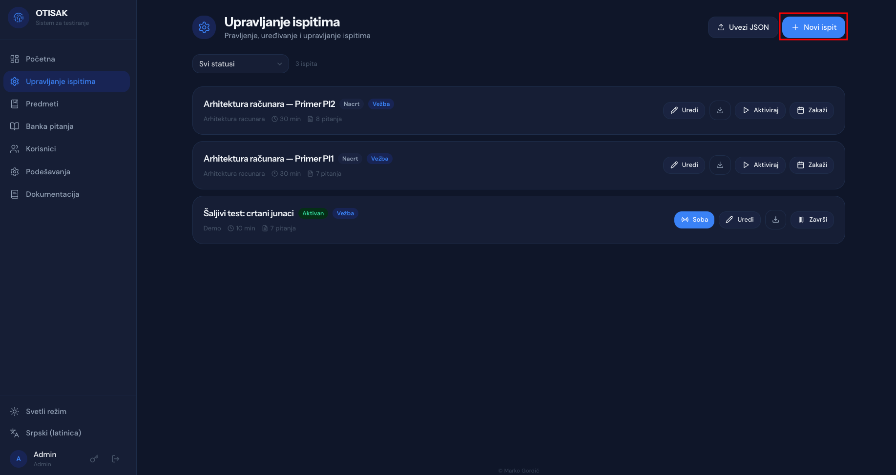
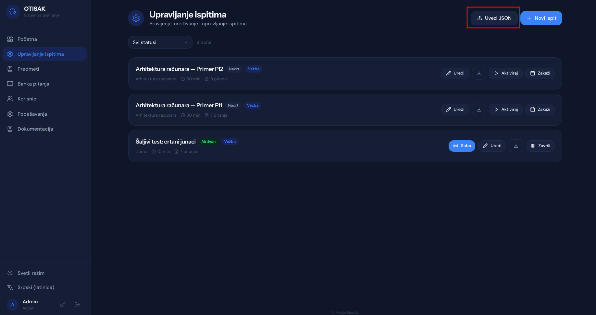
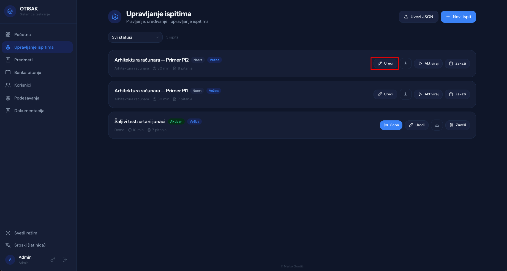
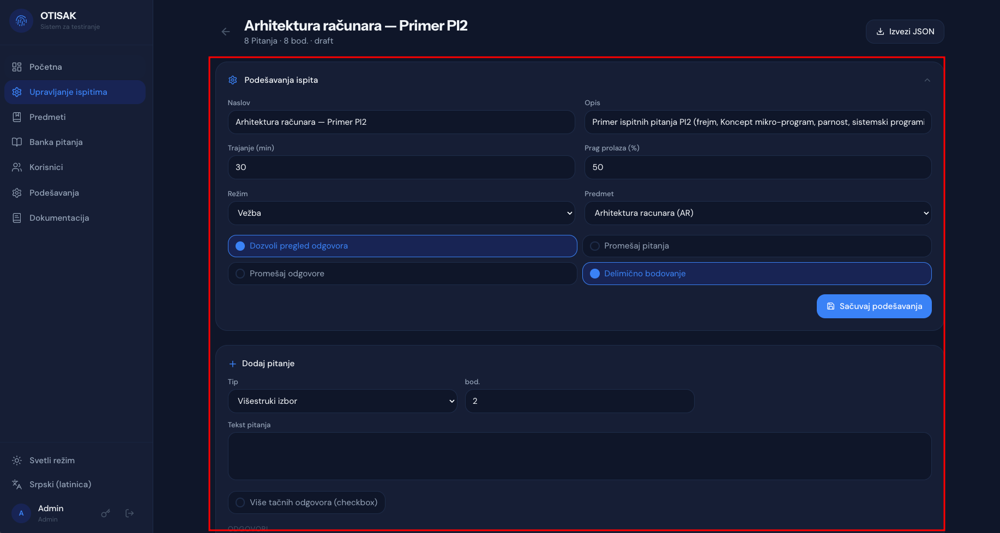

# Upravljanje ispitima

Stranica "Upravljanje ispitima" prikazuje **prave ispite**. Vežbe imaju svoju stranicu na `/practice`, vidi [Vežbe](practice.md). Režim ispita se određuje stranicom na kojoj ga praviš i ne može da se promeni kasnije.

## Kreiranje ispita

Postoje dva načina za kreiranje ispita: ručno kreiranje pojedinačnih ispita i uvoz ispita putem JSON datoteke.

### Ručno kreiranje ispita

Klikom na dugme "Novi ispit" u gornjem desnom uglu otvara se forma za kreiranje novog ispita. Potrebno je uneti:
1. Naslov ispita (ovo je tekst koji će biti prikazan studentima na stranici sa ispitima)
2. Predmet (izabrati iz padajuće liste)
3. Trajanje ispita u minutima

Klikom na dugme "Napravi" ispit će biti kreiran i prikazan u listi ispita, kao nacrt i kao pravi ispit. Za kreiranje vežbe koristi stranicu `/practice`.



### Kreiranje ispita uvozom JSON datoteke

Druga mogućnost za kreiranje ispita je uvoz ispita putem JSON datoteke. Klikom na dugme "Uvezi JSON" otvara se forma za uvoz.



Potrebno je:

1. Odabrati JSON datoteku sa ispitom.
2. Odabrati **predmet**. Obavezan je i jači je od svega što piše u datoteci. Asistenti vide samo svoje predmete, a uvoz pod tuđi predmet vraća `403`.
3. Pokrenuti uvoz. Ispit se pravi kao nacrt i kao **pravi ispit**, zato što si na stranici `/manage`. Za uvoz vežbe uradi isto na `/practice`.

Datoteka treba da bude u ovom obliku:

```json
{
  "version": 1,
  "exam": {
    "title": "Arhitektura računara - Primer PI",
    "description": "Primer ispitnih pitanja PI",
    "duration_minutes": 30,
    "pass_threshold": 50,
    "allow_review": true,
    "shuffle_questions": false,
    "shuffle_answers": false,
    "partial_scoring": true,
    "negative_points_enabled": false,
    "negative_points_value": 0,
    "negative_points_threshold": 0
  },
  "questions": [
    {
      "type": "text",
      "text": "Frejm sadrži:",
      "points": 1,
      "position": 0,
      "multi_answer": true,
      "answers": [
        { "text": "argumente", "is_correct": true,  "position": 0 },
        { "text": "globalne promenljive", "is_correct": false, "position": 1 },
        { "text": "povratnu adresu", "is_correct": true,  "position": 2 },
        { "text": "lokalne promenljive", "is_correct": true,  "position": 3 },
        { "text": "nijedan od ponuđenih odgovora nije tačan", "is_correct": false, "position": 4 }
      ]
    }
  ]
}
```

Za sva polja, sve podrazumevane vrednosti i sve tipove pitanja vidi [JSON format ispita](json-format.md).

Dugme "Izvezi JSON" na svakom redu pravi datoteku istog oblika, pa ispit može da se prebaci u drugo okruženje ili sačuva kao rezerva.

Nakon uspešnog uvoza, ispit će biti prikazan u listi ispita. Ukoliko je potrebno, nakon kreiranja ispita moguće je izvršiti izmene podešavanja ispita, kao i dodati ili izmeniti pitanja i odgovore.

## Izmena ispita

U listi ispita klikom na dugme "Uredi" moguće je izvršiti izmene podešavanja ispita, kao i dodati ili izmeniti pitanja i odgovore.



