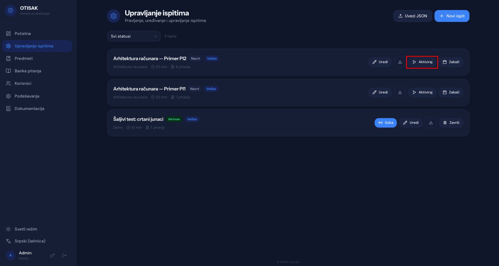
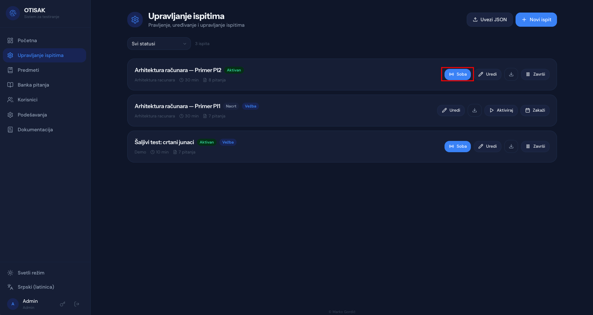
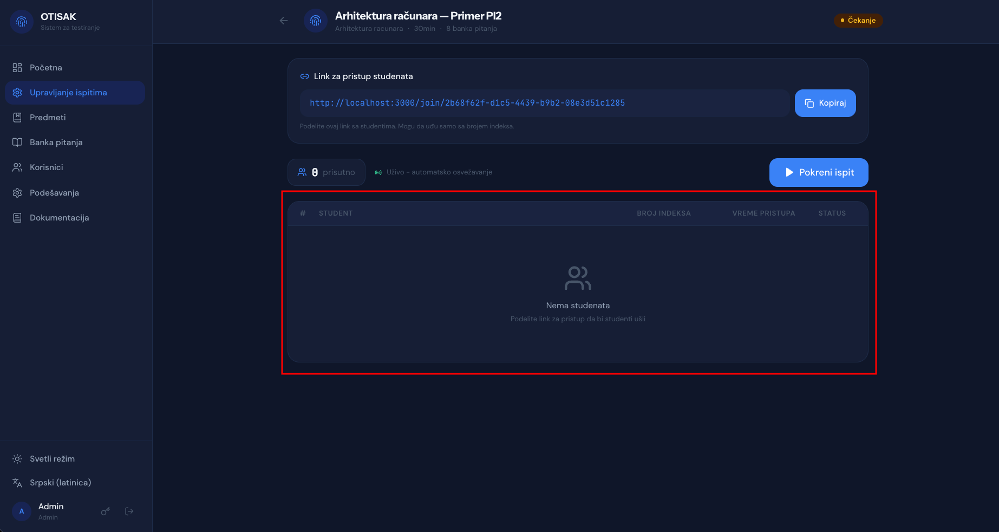
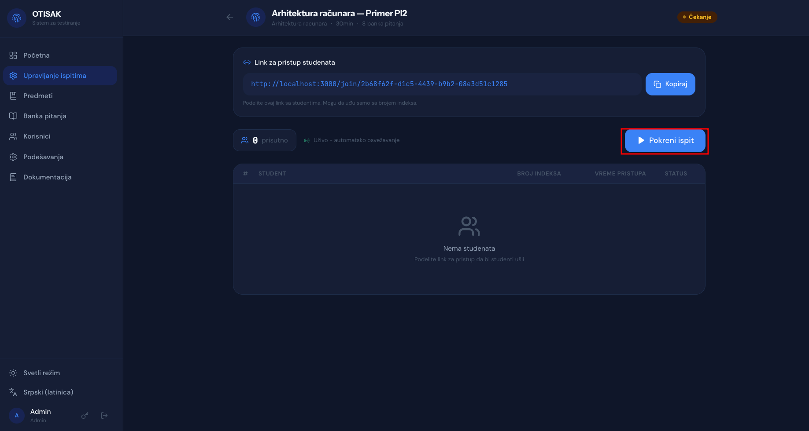
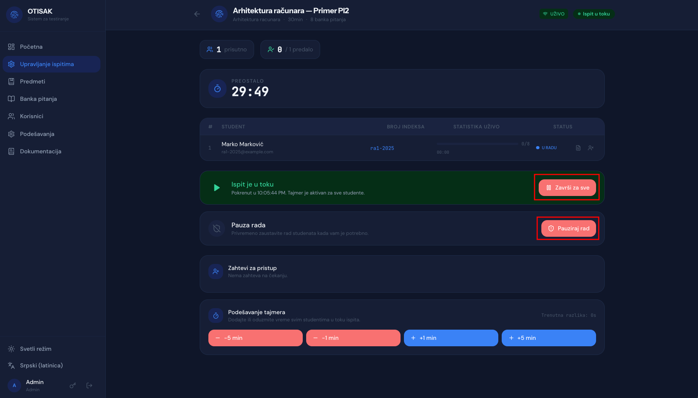
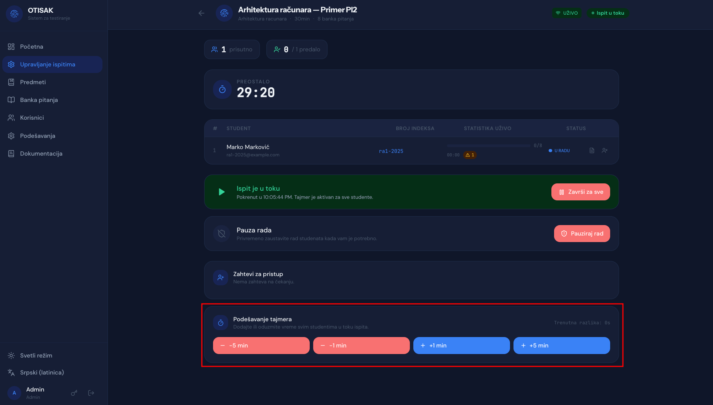
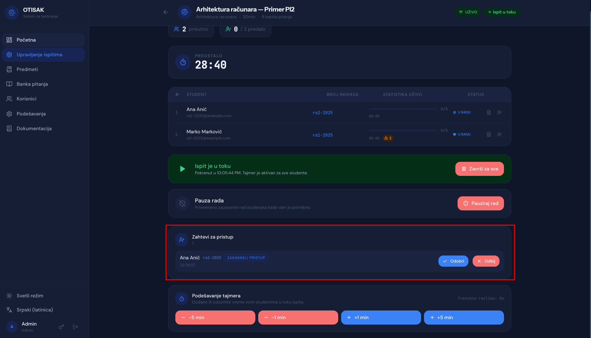

# Pokretanje i vođenje testa

Na stranici "Upravljanje ispitima" klikom na dugme "Aktiviraj" pored odgovarajućeg testa pokrećete test.

Nakon pokretanja testa, pojaviće se dugme "Soba".

Klikom na dugme "Soba" otvara se nova stranica sa listom svih učesnika koji su se prijavili na test. Na ovoj stranici možete pratiti ko je trenutno na testu, a ko nije.

Klikom na dugme "Pokreni ispit" pokrećete test za sve učesnike koji su se prijavili.

!

## Vođenje testa

Na samoj stranici "Soba" postoji mogućnost prekida ili pauziranja testka.

Pauziranje testa se vrši klikom na dugme "Pauziraj rad". Nakon pauziranja, svi učesnici koji su trenutno na testu će biti obavešteni o pauzi i neće moći da nastave sa testom dok se ne nastavi. **Tokom trajanja pauze tajmer će biti zaustavljen.**

Klikom na dugme "Završi za sve" prekidate ispit za sve učesnike, na njihovim ekranima će se pojaviti rezultati ili će direktno biti preusmereni na početnu stranicu OTISAK aplikacije.

## Upravljanje tajmerom

U sekciji "Podešavanje tajmera" je moguće manipulisati preostalim vremenom za izradu testa.

## Upravljanje zahtevima za pristup

U slučaju kada student pokuša da pristupi testu nakon njegovog početka sistem će obavestiti asistenta o tome, a asistent mora da odobri ili odbije zahtev za pristup unutar sekcije "Zahtevi za pristup".

