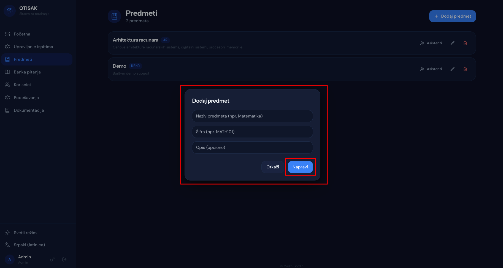

# Upravljanje predmetima

## Kreiranje predmeta

Na stranici "Predmeti" u gornjem desnom uglu se nalazi dugme "Dodaj predmet".

Klikom na dugme "Dodaj predmet" otvara se forma za kreiranje predmeta. Potrebno je uneti naziv predmeta, šifru predmeta za internu identifikaciju i opciono dodati opis predmeta.

Nakon popunjavanja forme, klikom na dugme "Napravi" predmet će biti kreiran i prikazan u listi predmeta.