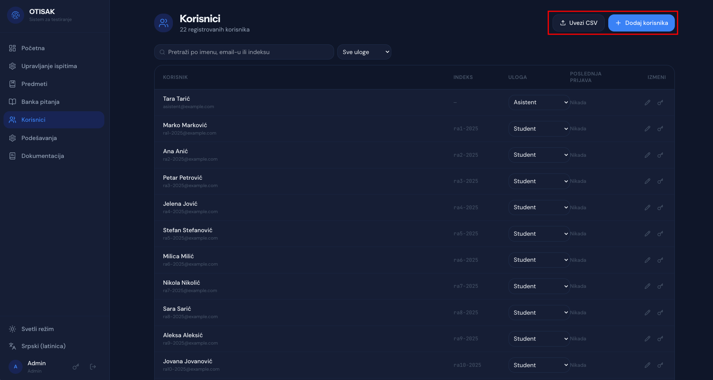
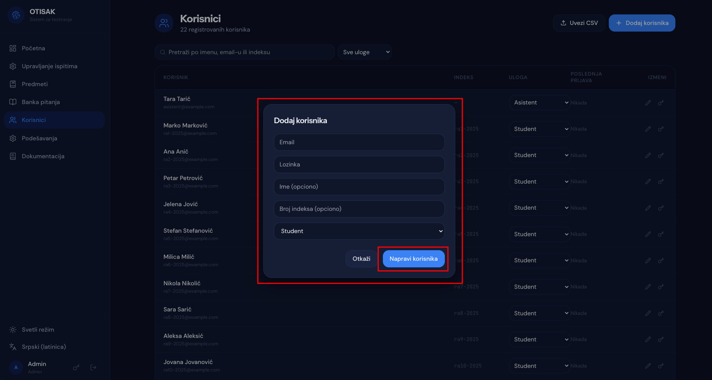
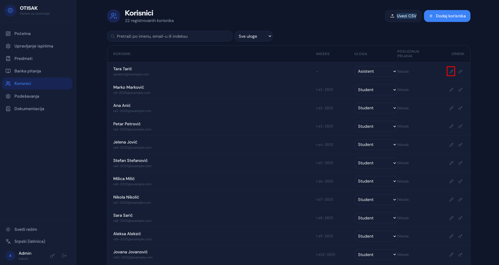
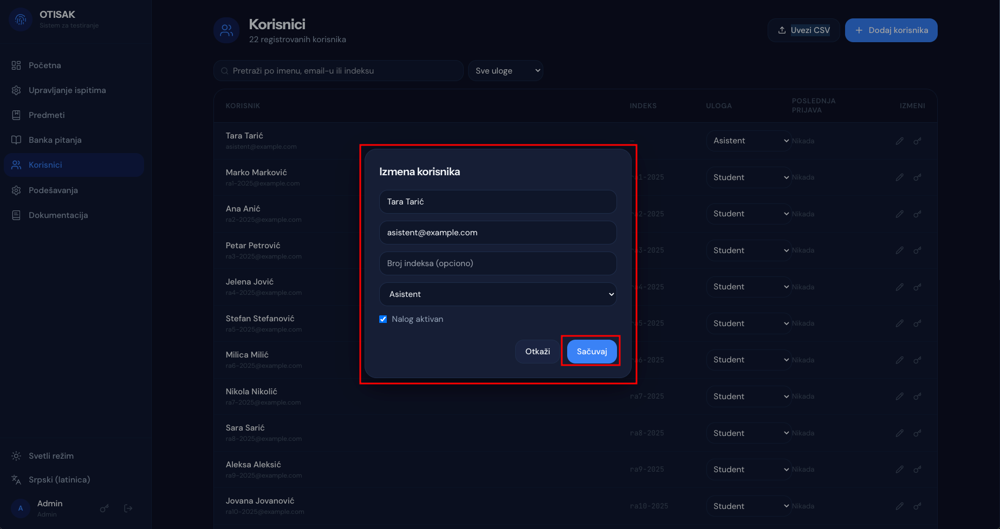
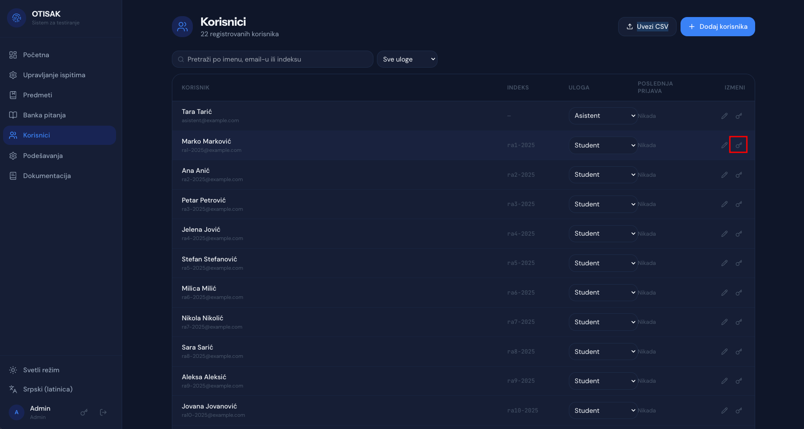
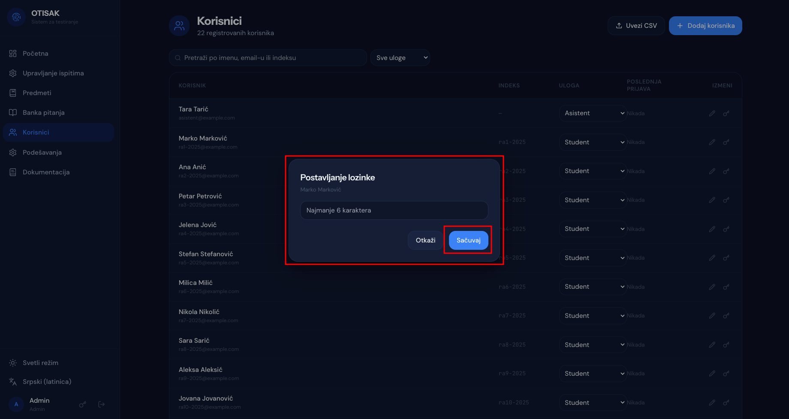

# Upravljanje korisnicima

## Kreiranje i uvoz korisnika

Na stranici "Korisnici" postoji dva načina za kreiranje korisnika: ručno kreiranje pojedinačnih korisnika i uvoz korisnika putem CSV datoteke.



### Ručno kreiranje korisnika

Klikom na dugme "Dodaj korisnika" otvara se forma za kreiranje novog korisnika. Potrebno je uneti:
1. Email korisnika
2. Lozinku
3. U polje "Ime" je potrebno uneti ime i prezime korisnika, odvojene razmakom.
4. Indeks u formatu "xxyyy-zzzz", gde je xx šifra smera, yyy je redni broj studenta, a zzzz je godina upisa.
5. Izabrati ulogu korisnika (Student, Asistent ili Profesor).

Klikom na dugme "Napravi korisnika" korisnik će biti kreiran i prikazan u listi korisnika.



### Uvoz korisnika putem CSV datoteke

Klikom na dugme "Uvezi CSV" otvara se sistemska forma za odabir datoteke. Potrebno je odabrati CSV datoteku sa korisnicima. CSV datoteka treba da bude u sledećem formatu:

```
email,lozinka,ime,indeks,uloga
user1@example.com,password1,John Doe,in1-2023,Student
user2@example.com,password2,Jane Smith,in2-2023,Student
```

Nakon uspešnog uvoza, korisnici će biti prikazani u listi korisnika.

## Izmena podataka o korisniku

U listi postojećih korisnika, klikom na ikonicu olovke pored korisnika otvara se forma za izmenu podataka o korisniku. U ovoj formi možete promeniti email, ime, indeks i ulogu korisnika. Nakon unosa izmena, klikom na dugme "Sačuvaj" promene će biti sačuvane i prikazane u listi korisnika. Takođe, moguća je i deaktivacija naloga.





## Promena lozinke

U listi postojećih korisnika, klikom na ikonicu ključa pored korisnika otvara se forma za promenu lozinke. U ovoj formi potrebno je uneti novu lozinku koja mora imati najmanje 6 karaktera. Nakon unosa nove lozinke, klikom na dugme "Sačuvaj" lozinka će biti promenjena i korisnik će moći da se prijavi novom lozinkom.



